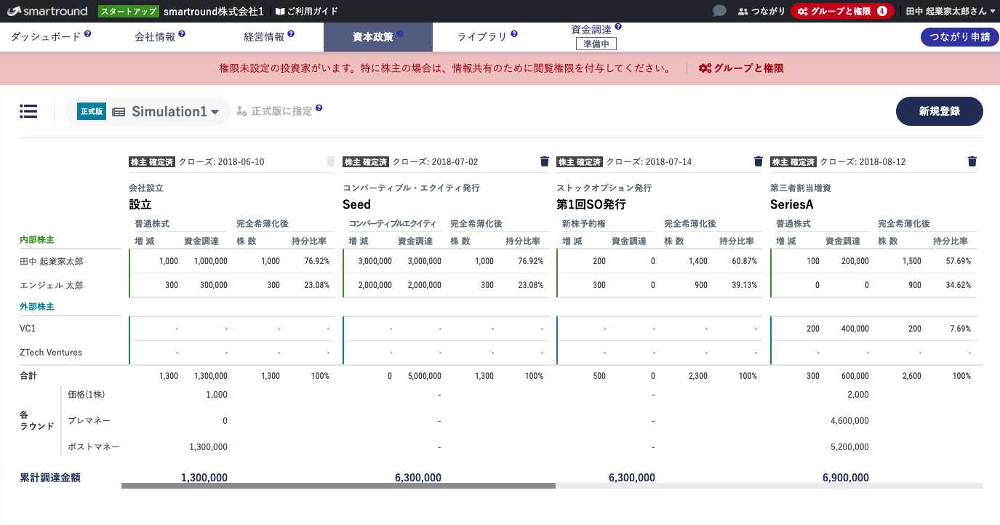
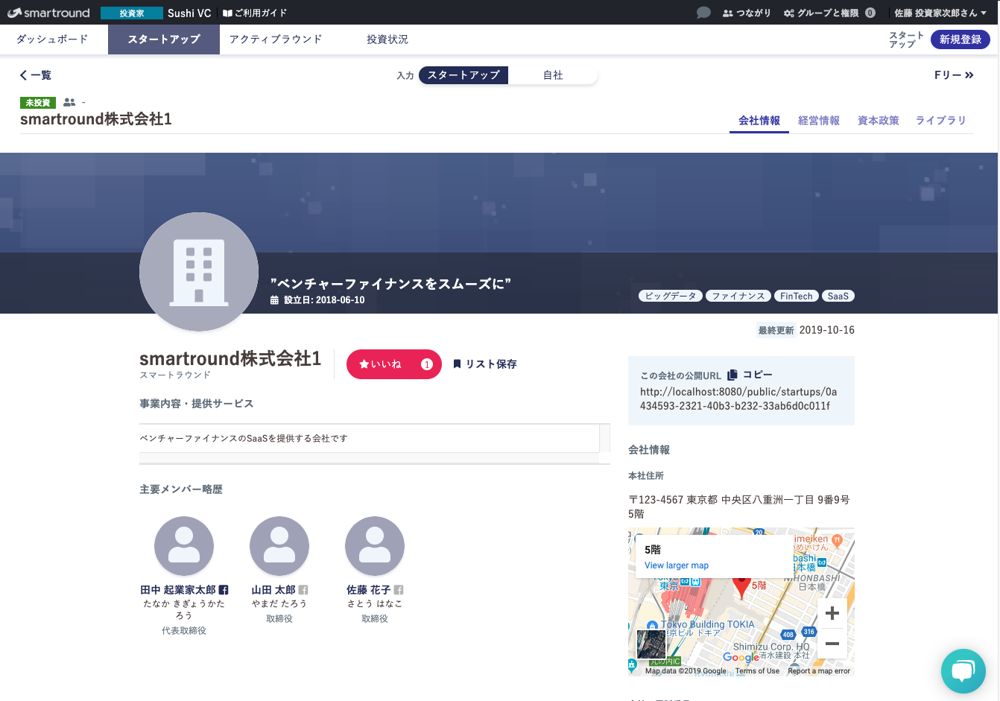
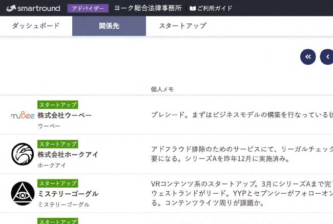

@snap[midpoint span-100]
### smartroundを支える技術
@snapend

---

### 初めに

* この資料は2019年10月時点の内容です
* まだサービス開発開始後1年未満で急成長中なので それを踏まえた上で現在とのDiffは脳内補完してください

---

### この資料で紹介すること

* 技術スタック
* smartroundのシステムとしての特徴
* 技術選定の背景・理由

---

### サービスについて

@snap[west span-50]

@snapend

@snap[east span-50]
* スタートアップが資金調達するプロセスを効率化するサービスです
* スタートアップ・投資家・アドバイザー（士業）向けの3サービスを提供しています
* [サービスURLはこちらです](https://jp.smartround.com)
@snapend

---

### 技術スタック1: サービス利用技術

* Frontend
  * 言語: Typescript / SCSS
  * フレームワーク: Vue.js
* Backend
  * 言語: Kotlin(JVM)
  * フレームワーク: Ktor
* DB
  * RDB: PostgreSQL
  * KVS: Redis
* Infrastructure
  * AWS
  * 構成管理にTerraform / Serverless
  
---

### 技術スタック2: 開発ツール

* Communication
  * Slack / Github / Zenhub
* Design
  * Figma / Zeplin
* DevOps
  * CircleCI
* Monitoring
  * TrackJs

---

### smartroundのシステムとしての特徴

1. UX/UIの追求
  * 先行サービスが日本では少ないため、とにかくわかりやすいサービスにする必要がある
2. セキュリティ
  * 特に、他社のデータを閲覧できるというSaaSとしては珍しいサービス特性

---

### フロントエンドについて

---

### Vue.js採用背景

* Vue.jsを採用
 * スタートアップらしいリッチでイケてるUIにしたい
 * 一方工数はそこまでかけられない
 
⇒ 段階的に適用していくことができるVue.jsがFitした

---

### フロントエンドの特徴1

@snap[west span-50]
xx
@snapend

@snap[east span-50]
* 数値計算等の処理もあるため、JSに型がつけられるTypescriptを採用しました
 * 例) UXが重要なシーンではフロントリッチで数値計算等も行う
@snapend

---

### フロントエンドの特徴2

* UXを上げるため、Drag and Drop APIなりをUXが重要なページでは惜しまずつかう。
	※ 権限UIの良い感じの画面キャプチャとかあるイメージ
	※ リアルタイム保存のスプレッドシートの話も書くと良さそう
* 他にもWeb Pushやwebsocket等、UX上重要な事項に様々チャレンジしています。
---

### コンポーネント設計

* サービス規模が大きく長期的な目線で開発していけるようにしたいと考えているため、コンポーネント設計についても意識しています。
* [（社内向け資料ですが）StoryBookも公開しているのでご参考ください](https://github.com/smartround/smartround-storybook) 

---

### サーバサイドについて

---

### サーバサイド概要

レイヤをしっかり分けている
 * 権限制御を複数レイヤで行うため
 * 3サービス同時展開のためコードのメンテナンス性の確保する必要があるため

---

### サーバサイドアーキテクチャ

 小山が簡単な図を書く

---

### インフラについて

---

### インフラ

利用しているAWSサービスの一例です。

* WebApp
  * ElasticBeanstalk / RDS / Elasticache
* Batch
  * Lambda
* WebsocketAPI
  * API Gateway / Lambda / DynamoDB 
* Build / Deploy
  * CodeBuild / CodePipeline
* Others
  * Route53

今後の拡張に備え、なるべく一般的な構成にすることを意識しています。

---

### 現在のチーム

* エンジニア3名、デザイナー1名という少数精鋭で進めています。
* やりたいことはたくさんあり、自身の力量が ダイレクトに反映されるやりがいのある仕事です💪

---

### その他魅力1

サービス開発スタート時から今に至るまで 同じエンジニア・デザイナーがフルコミット

* 初期から一貫した思想でUI/UXやコードベースが 作られてきました
* スタートアップあるあるの立ち上げ期の謎の負債は 極めて少ないです 

---

### その他魅力2

* ベンチャーファイナンスに詳しくなれます💰
* 社長が「自身で起業した会社をNTTドコモに売却した経験」「米国のVentureCapital勤務経験」等このドメインにとても詳しいので、様々学べます。

---

### 採用ページ

一緒にサービスを作っていきたい方お待ちしてます！
[Wantedlyページ](https://www.wantedly.com/companies/company_4346433/projects)
